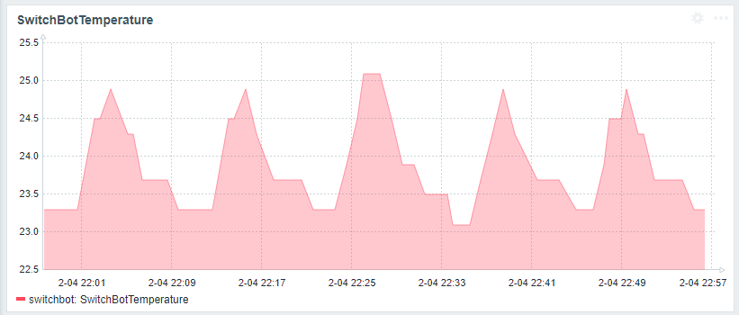

# Play with SwitchBot API
In this project, You use SwitchBot API to get parameters from your SwitchBot devices.

## Environment
- Python 3
- python-dotenv
  - https://pypi.org/project/python-dotenv/
- SwitchBot API v1.1
  - https://github.com/OpenWonderLabs/SwitchBotAPI

## Get Secret Key and Token
check [How to obtain a Token?](https://support.switch-bot.com/hc/en-us/articles/12822710195351) from SwitchBot official site.

## get Device ID
You need device id to get parameters from your SwitchBot.
1. Install python-dotenv
```bash
pip install python-dotenv
```
2. Create .env file

you can use .env.example
```bash
cp .env.example .env
```
3. Edit .env file

set your secret key and token you got from the previous step
```bash
vi .env
```
4. Run
```bash
python3 get_device_id.py
```

### sample response
```json
{'body': {'deviceList': [{'deviceId': 'XXXXXXXXXXXXXXXX',
                          'deviceName': 'XXXXXXXXXXXXXXXX',
                          'deviceType': 'XXXXXXXXXXXXXXXX',
                          'enableCloudService': True,
                          'hubDeviceId': ''}],
 'message': 'success',
 'statusCode': 100}
```
Use `deviceId` in the next step.

## get Response
You can get the response from your SwitchBot device.
```bash
python3 get_response.py $KEY $DEVICE_ID
```

- $KEY 

    the key you want to get from your SwitchBot device.
    check [here](https://github.com/OpenWonderLabs/SwitchBotAPI?tab=readme-ov-file#responses).

- $DEVICE_ID 

    the device id you got from the previous step.

### Example
I want to get the temperature from Hub 2.
```bash
python3 get_response.py temperature "my_device_id"
```
I get below response.
```json
25.5
```

## And more
- get temperature and monitor with zabbix
